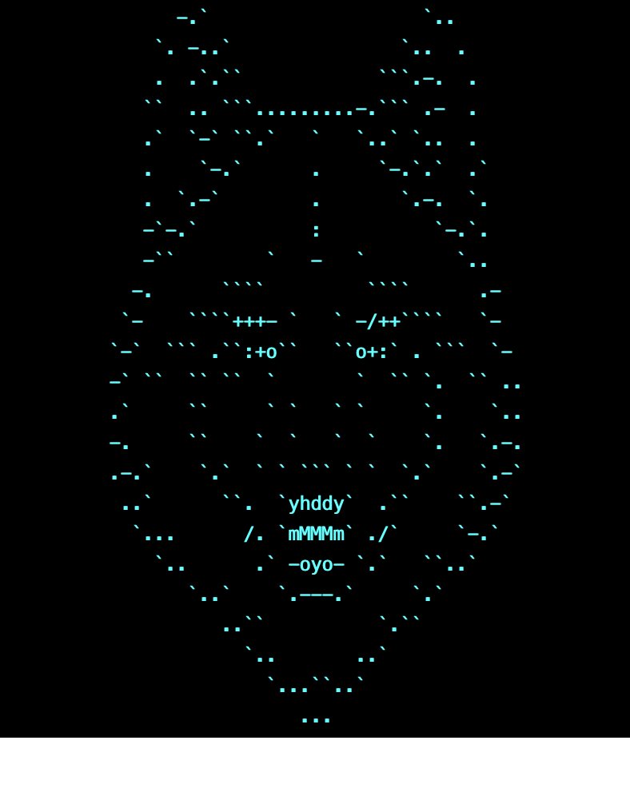

# lupo
Modular C2 server to tame your pack of wolves.

  

## Current Release
- [v1.3.2](https://github.com/InjectionSoftwareandSecurityLLC/lupo/releases/tag/v1.3.2) - Version 1.3.2 Release!

## Documentation
- [Usage Docs](./docs/README.md)
- [Source Code Docs](https://pkg.go.dev/github.com/InjectionSoftwareandSecurityLLC/lupo)
- [Contributing](contributing.md)

v1.3.1 Features:
- [x] Support for process injection commands that deliver shellcode payload data and process identifiers for implants to implement (BYOA - Bring your own allocation)
- [x] Better multi function hook sample provided in the `sample` implant directory
- [x] Added `updateinterval` subcommand to Sessions CLI to allow for dynamic updates to implant check-in delays 
- [x] Added persistence handler updates to all listening modules
- [x] Implement data response and check in status intervals
- [x] Implement registering custom functions
- [x] Consider creating a "color" library in core to handle custom colors across the entire application
- [x] Port finished HTTP server to HTTPs
- [x] Enhance custom functions
- [x] Implement TCP listener
- [x] Implement "wolfpack" teamserver with client binary generation
- [x] Implement extended functions like upload/download and any other seemingly "universal" switches
- [x] Implement a web shell handler for bind web shells
- [x] Consider random PSK generation rather than a default base key
- [x] Add Exec command to allow local shell interaction while in the Lupo CLI
- [x] Reformat the ASCII art so it is printed a bit more cleanly
- [x] Document API
- [x] Document core features
- [x] Create demo implants to show off all the feature/functionality
- [x] Repo art update and open source!
- [x] Implement config file for lupo server to auto supply configs (done via metasploit-style resource file for simpler automation)
- [x] Implement optional encryption flag for TCP
- [x] wolfpack chat
- [x] Removed old TLS generation bash script - Lupo generates TLS certs automatically now and still provides the option to bring your own :)
- [x] MUTIPLAYER MODE STABLE!!! - fixed major bug with state management that broke mutiplayer mode if you ran a command on the server before using the client
- [x] Added the ability to execute commands across mutiple sessions based on session ID or Arch (OS) filter with wildcard support
- [x] Implement DNS C2
- [x] Experimental LLM implant generation template :)
- [x] BOF/COFF loading API added
- [x] Async BOF/COFF loading API added (Experimental)
- [x] PE loading API added
- [x] Stager feature added to host static files for things like multi staged implants and DLL injection.
- [x] Made the HTTP/HTTPS handlers more API like with CORS headers for fun browser/API behavoir stuff.

Road Map:
- [ ] Consider Implementing Proxying (Cool for v2 should be easy with a go revproxy lib or messenger integration)
- [ ] Consider Implementing UDP listener (We have DNS now...but raw UDP is next!)
- [ ] Implement Procdump API to support process dumping (can use the stager API)
- [ ] Web interface for wolfpack server
- [ ] Implement Github Actions to get automated builds for future releases
