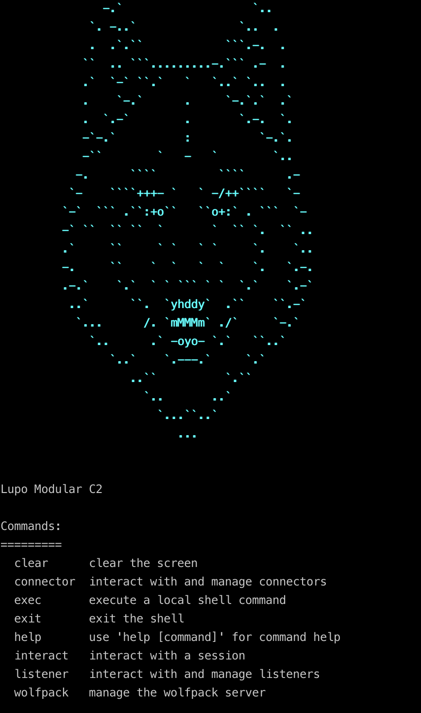

# Usage Documentation

- [General Usage (Server/Client)](./server/general_cli.md)
- [Server Usage](./server/server.md)
- [Client Usage](./client/client.md)
- [API](./server/api.md)
- [Wolfpack API](./server/wolfpack.md)
- [Implant Development](./implants/implants.md)