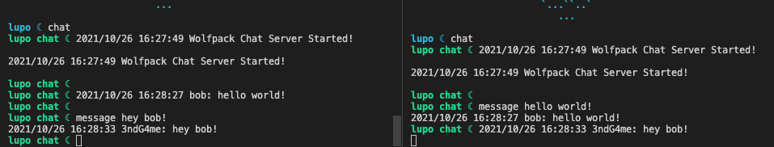

# Client Usage

This document will describe the various commands and sub commands available in that are unique to the Lupo client. All commands here are only available on the client which means they either have not or will not be implemented in the server. The documentation will reflect this functionality as consistently as possible.

Please note, this document will not be comprehensive as CLI is "self documenting", meaning that you can get detailed usage information about any command within Lupo by simple running `help <command>` or `help <command> <subcommand>` etc...

For general usage on both client and server see the the[General Usage (Server/Client)
](../server/general_cli.md) documentation. For usage specific to the client, see the [Server](../server/server.md) documentation.

## Client Flags
The Wolfpack client is a CLI program that serves as a front end to interface with a Wolfpack server instance. These clients allow for multi-operator use of the Wolfpack server and currently implements all commands of the server except for the `wolfpack` command to prevent non-privileged users from arbitrarily changing Wolfpack configurations without having access to the Lupo server's host. Currently the client can take a flag for a resource file and a wolfpack json configuration file.
- `-c` (Flag): this is the "configuration" flag. passing this flag the name of a client configuration JSON file will tell it to use that configuration for authentication. by default it looks for the file `wolfpack.json` in the same directory as the binary.
- `-r` (Flag): this is the "resource file" flag. passing this flag the name of a saved resource file containing lupo commands. this will load in the file and execute each lupo command in sequence for automation.

## Wolfpack Chat
The Wolfpack team server supports a built in chat CLI that is encrypted over HTTPS and builds on top of the standard Wolfpack API. This chat CLI is available as a root command and contains only two subcommands for writing messages and leaving the chat CLI.
- chat: base command to enter into the Chat CLI. Works identical to the Session CLI but is just for interacting with the chat. Once this command is ran a call to the Wolfpack API is made to pull down the latest chat log.
    - (sub command) back: exits the Lupo Chat CLI.
    - (sub command) message: allows you to send a message to the chat server that will be broadcast to everyone in the chat.
