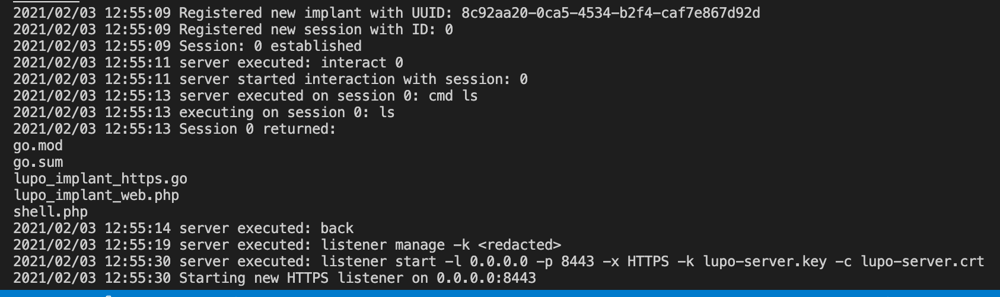

# General Usage (Server/Client)

This document will describe the various commands and sub commands available in Lupo. All commands here are universal across the server and client. This means that, outside of a few custom error message use cases, you can operate Lupo with any of these commands regardless of whether you operate it from the server CLI or from a client CLI in conjunction with the Wolfpack Server.

Please note, this document will not be comprehensive as CLI is "self documenting", meaning that you can get detailed usage information about any command within Lupo by simple running `help <command>` or `help <command> <subcommand>` etc...

Instead this will show case the most common commands and how to use them then split [Server](./server.md) and [Client](../client/client.md) specific commands to their own documentation respectively.

## Lupo Commands
- exec: executes a local system command so the user can interact with their local session without leaving the Lupo CLI.
- connector: base command for establishing bind based connections over HTTP/HTTPS. Good for bind based implants or web shells.
    - (sub command) start: takes several flags to start a bind connection over HTTP/HTTPS and establish a permanent session that is managed by the interact/session commands. Starting a basic connection to a PHP based web shell might work like this:
        - Start connector: `connector start -d shell.php -r example.com -p 8080 -x HTTP` (example shown running on localhost):
        
        - A session should open allowing execution to "http://example.com:8080/shell.php?cmd=(CMD)" with GET based queries via HTTP. The placeholder (CMD) will be populated when executing the `cmd` sub command within the session shell.
- interact: base command for interacting with sessions. using the interact command and passing it a valid session ID will drop the user into a `session` cli where they can begin interaction with that session.
    - (sub command) clean: cleans all sessions from Lupo where status is `DEAD`. this will not stop the session from trying to reconnect if it ever comes back online, but depending on how the implant was implemented, it may not be able to re-stablish a valid session (a re-authentication routine would need to be added by that implant's developer). it does however, remove the session from the active sessions preventing the same authentication identifiers from being reused, and of course removes the ability to interact with it.
    - (sub command) kill: removes a specific session. works exactly like `clean` does but only on one specific session regardless if the session is `ALIVE` or `DEAD`.
    - (sub command) show: shows all registered sessions and relevant information such as hosts and statuses.
- listener: base command for managing listeners. current supported listeners are HTTP, HTTPS, and TCP.
    - (sub command) kill: removes a specified listener by ID and kills the corresponding server routine running it.
    - (sub command) manage: manage global listener attributes such as the PSK (random by default).
    - (sub command) show: shows all running listeners and their meta information.
    - (sub command) start: configure and start a new listener. A sample command for a basic HTTPS server might look like this:
        - Start listener: `listener start -l 0.0.0.0 -p 8443`
        - That command will start an HTTPS listener using the default TLS keys used by generating the `generate_tls_cert.sh` script as long as they are located in the same directory as the server binary. All of these options can of course be modified using the relevant flags/arguments available in the CLI.
        - Sample showing setting a custom PSK, starting a listener, showing active listeners, and killing a listener:
        
- session: base command, a sub shell that allows interaction with a session specified from the `interact` command.
    - (sub command) back: returns to the core Lupo CLI shell.
    - (sub command) cmd: sends/posts a command that will be collected or received by a given connection/implant and executed as a system command.
    - (sub command) download: downloads a file from the target session _if_ they have a download handler implemented.
    - (sub command) kill: kills a specified session, requires an argument so you don't accidentally kill your current interacted with session. this works the same way as `interact kill` does.
    - (sub command) load: loads extended functions if they are available to a given session/implant
    - (sub command) session: swaps between sessions within the session sub shell so the user doesn't need to go back and use `interact` to switch sessions.
    - (sub command) upload: uploads a file to the target session _if_ they have an upload handler implemented.

## Logging
Lupo implements some sophisticated yet incredibly simple logging mechanisms. Lupo was designed with "Red Teaming" in mind. Operators should live, breathe, and die by their logs to replicate events, know where they messed up, but most importantly to verify and keep track of what they've done. 
- History: Lupo uses Grumble CLI's built in history file to keep a local history of all commands executed by an operator. This works like a bash history and is more for convenience than it is for logging, but is helpful nonetheless. Since this is local the server and client binaries' logs are local to their respective systems so retrieving a client's history would require having that physical machine. The history file is stored in `.lupo.history` by default.
- Operator Logs: Lupo implements a custom logger that is implemented throughout every relevant traceable event within Lupo and is easily added to other events as time passes. These are generated on the server and stored on the server meaning only those with access to the Lupo C2 server can read the logs. These are stored with a format of `YYYY/MM/DD 00:00:00 (24 Hour Format) <message>`. The log file is stored in `.lupo.log` by default. This log tracks everything from executed commands, configuration changes, responses between server/implants including files, command output, and check in information. Log sample:

- Chat Log: Lupo uses the same custom logger implemented by the Operator Logs function to log a chat history. The history is only stored on the Lupo server and can only be written to and accessed by the Lupo server. When a user enters the chat the log is read and sent to the chat instance being interacted with. When new messages are sent the message is written to the chat and the most recent line is then broadcasts to every Wolfpack user that is also in the chat CLI on their Lupo client. These are stored with a format of `YYYY/MM/DD 00:00:00 (24 Hour Format) <Username>: <message>`.

## Helpful Tools
Included with the Lupo C2 repo there are a handful of helper scripts/programs to help folks get started.

- The `generate_tls_cert.sh` scripts requires openssl to be installed, but if it is this script can be used to quickly generate a TLS key pair that can be used to encrypt HTTPS communications in Lupo. This is required to use functions such as the `wolfpack` team server and the HTTPS listener. You are free to use lets encrypt or any other method of creating self-signed certs for Lupo as long as the provided key pair can be read in as their respective "server.crt" and "server.key" files. By default Lupo will read in any file named `lupo-server.crt` and `lupo-server.key` as long as they exist in the same directory as the server binary.
- The [samples](../../samples) directory in the repository includes sample payloads that can be used with Lupo. These are meant to be feature complete examples that fully implement each API. These are purposefully not distributed as binaries to promote longevity, but the whole point of Lupo is to "bring your own implant", so feel free to use the provided samples as a base, but it is _not_ recommended to use them in real world engagements without prior obfuscation/modification. Remember, they are samples, and while they are feature complete, they are meant to serve as examples only. Read more in the [implants](../implants/implants.md) documentation. Use at your own risk. Currently implemented samples:
    - HTTP/HTTPS Golang Based Implant
    - Bind Connector PHP Based Web Shell
